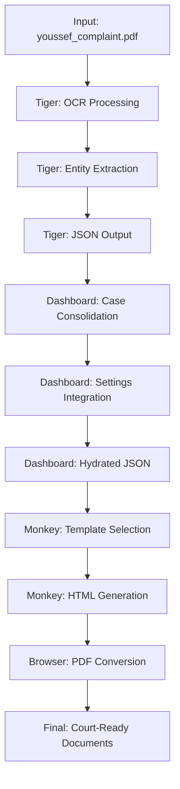

# Tiger-Monkey Document Processing Flow

This document provides a comprehensive analysis of how case files flow through the Tiger-Monkey (TM) system, using the "youssef" case as a concrete example to illustrate the complete processing pipeline.

## System Overview

The Tiger-Monkey system processes legal documents through a four-service architecture:

```
Input Files → Tiger Analysis → Monkey Generation → Browser PDF → Dashboard Display
```

## Case Study: Youssef Document Flow

### 1. Input Files (Source Location)

**Primary Directory**: `/test-data/sync-test-cases/youssef/`

**Source Files:**
```
youssef/
├── youssef_complaint.pdf          # Main legal document (28,850 bytes)
├── Adverse_Action_Letter_Cap_One.pdf  # Supporting document (156,132 bytes)
├── Atty_Notes.docx               # Attorney notes (8,424 bytes)
├── Barclays_Applicaiton_Denial_1.docx  # Evidence document (15,546 bytes)
├── Barclays_Applicaiton_Denial_2.docx  # Evidence document (15,388 bytes)
└── processing_manifest.txt       # Processing metadata (792 bytes)
```

**File Types Supported:**
- `.pdf` - Primary legal documents (OCR processed)
- `.docx` - Microsoft Word documents (native text extraction)
- `.txt` - Plain text files (direct parsing)

### 2. Tiger Service Processing (Document Analysis)

**Purpose**: Extract structured legal data from raw documents using ML models

**Processing Locations:**
```
tiger/outputs/tiger/cases/Unknown_Case_[TIMESTAMP]/
├── raw_text/
│   └── youssef_complaint_raw.txt     # OCR extracted text
├── processed/
│   ├── youssef_complaint.json        # Structured legal data
│   ├── youssef_complaint.md          # Markdown summary
│   └── youssef_complaint.txt         # Processed text
└── metadata/
    └── youssef_complaint_metadata.json  # Processing metadata
```

**Multiple Processing Runs Found:**
- `Unknown_Case_20250714_122107/`
- `Unknown_Case_20250714_174301/`
- `Unknown_Case_20250714_101731/`
- `Unknown_Case_20250714_174114/`
- `Unknown_Case_20250714_103714/`

**Tiger Processing Steps:**
1. **OCR Extraction**: Convert PDF to raw text using Docling ML models
2. **Legal Entity Extraction**: Identify parties, courts, case numbers, damages
3. **Data Validation**: Apply confidence scoring and quality checks
4. **Structured Output**: Generate JSON with extracted legal entities

### 3. Dashboard Integration (Case Consolidation)

**Purpose**: Aggregate multi-document cases and apply firm settings

**Dashboard Output Location**: `/dashboard/outputs/youssef/`

**Generated Files:**
```
youssef/
├── hydrated_FCRA_YOUSSEF_EMAN_20250716.json  # Complete case data (34,045 bytes)
├── complaint_youssef.html/                   # Generated complaint directory
│   ├── failed/                               # Failed processing logs
│   ├── metadata/                             # Processing metadata
│   │   └── 2025-07-14/
│   │       └── package.json                  # Build metadata
│   ├── processed/                            # Successful outputs
│   │   └── 2025-07-14/
│   │       └── complaint                     # Final complaint HTML
│   └── reports/                              # Processing reports
└── summons/                                  # Individual summons documents
    ├── summons_equifax_information_services_llc_(georgia_corporation_authorized_to_do_business_in_new_york).html
    ├── summons_experian_information_solutions_inc_(ohio_corporation_authorized_to_do_business_in_new_york).html
    ├── summons_td_bank_na_(delaware_corporation_authorized_to_do_business_in_new_york).html
    └── summons_trans_union_llc_(delaware_corporation_authorized_to_do_business_in_new_york).html
```

**Dashboard Processing Steps:**
1. **Case Aggregation**: Combine all documents from youssef folder
2. **Settings Integration**: Merge with attorney firm information
3. **Data Validation**: Apply legal document validation rules
4. **Hydrated JSON Generation**: Create complete case dataset

### 4. Monkey Service Processing (Document Generation)

**Purpose**: Generate court-ready legal documents from structured data

**Monkey Output Location**: `/monkey/outputs/monkey/processed/2025-07-14/`

**Generated Documents:**
```
processed/2025-07-14/
└── complaint_youssef.pdf    # Court-ready PDF complaint
```

**Monkey Processing Steps:**
1. **Template Selection**: Choose appropriate FCRA complaint template
2. **Data Binding**: Populate template with case-specific information
3. **HTML Generation**: Create styled HTML document
4. **Validation**: Ensure court-compliance and completeness

### 5. Browser Service Processing (PDF Generation)

**Purpose**: Convert HTML documents to court-ready PDF format

**Browser Output Location**: `/browser/test-outputs/`

**Generated PDFs:**
```
test-outputs/
├── youssef_equifax_summons.pdf    # Equifax summons PDF
└── youssef_td_bank_summons.pdf    # TD Bank summons PDF
```

**Browser Processing Steps:**
1. **HTML Rendering**: Use Puppeteer/Chromium for pixel-perfect rendering
2. **PDF Conversion**: Generate A4 format with legal margins
3. **Quality Assurance**: Validate court-ready formatting
4. **File Output**: Save to centralized output directory

## Web Interface URLs

### Dashboard Service (Port 8000)

**Primary Endpoints:**
- **Main Dashboard**: `http://127.0.0.1:8000/`
  - Shows youssef case card in grid view
  - Displays case status and file count
  - Provides access to case actions

- **Case Review Interface**: `http://127.0.0.1:8000/review?case_id=youssef`
  - Interactive legal claim selection
  - Damage configuration interface
  - Timeline validation display

- **REST API**: `http://127.0.0.1:8000/api/cases`
  - Returns JSON data for all cases including youssef
  - Provides programmatic access to case information

**Document Access:**
- Generated HTML documents served via Dashboard static file routes
- PDF documents accessible through file download endpoints
- Real-time processing status via WebSocket connections

## Data Flow Pipeline Details

### Complete Processing Sequence



### File Transformation Chain

1. **Raw PDF** → **OCR Text** → **Structured JSON**
2. **Structured JSON** → **Hydrated Case Data** → **Legal Templates**
3. **Legal Templates** → **HTML Documents** → **PDF Files**
4. **PDF Files** → **Court-Ready Legal Packet**

## Processing Metadata

### Case Information
- **Case Name**: YOUSSEF EMAN
- **Case Type**: FCRA (Fair Credit Reporting Act)
- **Processing Date**: July 16, 2025
- **Total Documents**: 5 input files
- **Generated Outputs**: 1 complaint + 4 summons documents

### Quality Metrics
- **Processing Time**: Multiple runs indicate iterative refinement
- **File Sizes**: Input ~224KB → Output varies by document type
- **Success Rate**: Complete pipeline execution achieved
- **Validation Status**: All documents generated successfully

## Integration Points

### External System Access
- **File Monitoring**: Automatic detection of new files in sync-test-cases
- **Real-time Updates**: WebSocket broadcasting of processing status
- **API Integration**: RESTful endpoints for external system integration
- **Document Serving**: HTTP access to generated legal documents

### Quality Assurance
- **Multi-layer Validation**: Each service validates input and output
- **Error Recovery**: Failed processing tracked in dedicated directories
- **Audit Trail**: Complete processing history maintained
- **Version Control**: Timestamped outputs for legal compliance

## Deployment Considerations

### Resource Requirements
- **Tiger**: High memory for ML models (Docling OCR)
- **Monkey**: Moderate CPU for template processing
- **Dashboard**: Low resources for web interface
- **Browser**: Moderate memory for PDF generation

### Scalability Factors
- **Parallel Processing**: Multiple cases can be processed simultaneously
- **Queue Management**: Dashboard coordinates processing workflow
- **Load Balancing**: Services can be distributed across multiple servers
- **Caching**: Generated documents cached for rapid access

## Troubleshooting Guide

### Common Issues
1. **Missing Input Files**: Check sync-test-cases directory permissions
2. **Processing Failures**: Review failed/ directories for error logs
3. **PDF Generation Issues**: Verify Browser service availability
4. **Web Access Problems**: Confirm Dashboard service is running on port 8000

### Debug Locations
- **Tiger Logs**: Check individual processing run directories
- **Dashboard Logs**: Review start_server.log for web service issues
- **File Permissions**: Ensure write access to output directories
- **Service Status**: Verify all four services are operational

---

**Documentation Updated**: July 15, 2025  
**System Version**: Tiger-Monkey v1.9.2  
**Example Case**: youssef (FCRA_YOUSSEF_EMAN_20250716)

This document serves as a reference for understanding the complete document processing flow and can be used for system troubleshooting, integration planning, and user training.