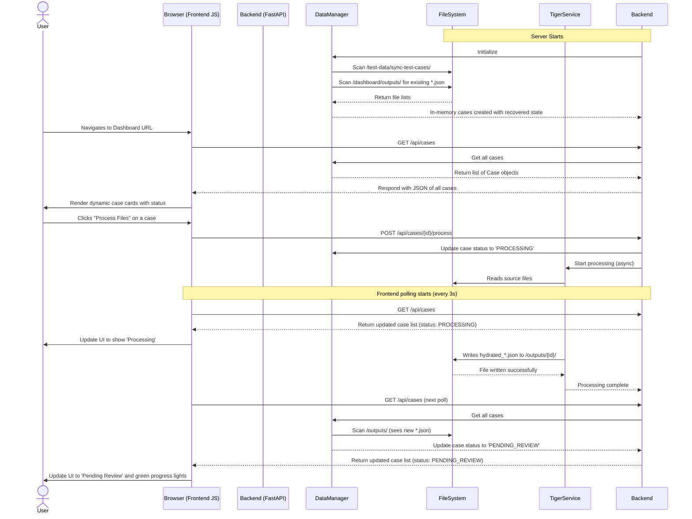

# TM Dashboard: Architecture and Data Flow

This document provides a comprehensive overview of the Tiger-Monkey (TM) Dashboard's architecture, with a focus on its data flow and state management mechanisms.

## 1. Relevant File Structure

The dashboard's functionality is distributed across several key files and directories within the project. Understanding this structure is essential for comprehending the data flow.

```
/Users/corelogic/satori-dev/TM/
├── dashboard/
│   ├── main.py              # FastAPI application entry point, API endpoints
│   ├── data_manager.py      # Handles all case data, state, and persistence logic
│   ├── models.py            # Pydantic models for all data structures (Case, CaseStatus, etc.)
│   ├── service_runner.py    # Integration layer for running Tiger/Monkey services
│   ├── static/
│   │   └── themes/
│   │       └── light/
│   │           ├── index.html         # Main HTML file (the UI container)
│   │           └── js/
│   │               ├── main.js        # Main frontend script, initializes polling
│   │               ├── api.js         # Handles all communication with the backend API
│   │               ├── ui.js          # Responsible for all DOM manipulation and rendering
│   │               └── eventHandlers.js # Binds and handles user interactions (e.g., button clicks)
│   └── outputs/             # ★ Stores generated files (e.g., hydrated_*.json), key for state persistence
└── test-data/
    └── sync-test-cases/     # ★ Source directory for case files, monitored for changes
```

## 2. Data Loading, Extraction, and State Updates

The dashboard employs a sophisticated process that combines in-memory state management with file-system-based persistence to provide a real-time, resilient user experience.

Here is a step-by-step breakdown of the entire flow:

### Step 1: Initial Load & State Recovery

1.  **Application Start**: The dashboard process is initiated, loading the FastAPI application in `dashboard/main.py`.
2.  **DataManager Initialization**: Inside `main.py`, a singleton instance of `DataManager` (from `dashboard/data_manager.py`) is created. It is configured with the paths to the `CASE_DIRECTORY` (`test-data/sync-test-cases/`) and the `OUTPUT_DIR` (`dashboard/outputs/`).
3.  **Case Scanning**: The `DataManager` immediately scans the `CASE_DIRECTORY` for subdirectories, each representing a unique case.
4.  **State Recovery (The Smart Part)**: For each case folder found, the `DataManager` performs "state recovery." It checks for the existence of a corresponding output folder in `dashboard/outputs/`.
    *   **If a `hydrated_*.json` file is found**, the system intelligently infers that the case has already been processed. It updates the in-memory `Case` object's status to `PENDING_REVIEW` and sets the `classified` and `extracted` progress flags to `true`. This critical step ensures that progress is not lost between server restarts.
    *   **If no output file is found**, the case is considered `NEW`, and its state is initialized with default values.

### Step 2: Frontend Rendering

1.  **User Access**: A user navigates to the dashboard's URL. Their browser receives the `index.html` file. This file is a clean template, devoid of any hardcoded case data.
2.  **JavaScript Execution**: The browser loads the JavaScript modules, starting with `js/main.js`.
3.  **Initial API Call**: `main.js` immediately triggers a call to the `/api/cases` endpoint via the `api.js` module.
4.  **Loading State**: While the API call is in flight, the `ui.js` module renders a "Loading cases..." indicator on the screen, providing immediate feedback to the user.

### Step 3: Dynamic Content Display

1.  **API Response**: The FastAPI backend, having already loaded all case data into the `DataManager`, returns a complete JSON list of all `Case` objects.
2.  **UI Rendering**: The `api.js` module receives the JSON response. The `ui.js` module then dynamically generates the HTML for each case card, populating the name, status, file list, and progress lights according to the data received from the API.

### Step 4: User-Triggered Processing

1.  **User Interaction**: The user clicks the "Process Files" button on a specific case card.
2.  **Event Handling**: The `eventHandlers.js` module captures this click. It correctly identifies the unique `case_id` by reading the `data-case-id` attribute from the DOM element.
3.  **Processing Request**: The handler uses `api.js` to send a `POST` request to the `/api/cases/{case_id}/process` endpoint.

### Step 5: Backend Processing & State Update

1.  **API Endpoint Logic**: The `main.py` endpoint receives the request. It locates the relevant case in the `DataManager`.
2.  **Immediate State Update**: The `DataManager` updates the in-memory state of that case to `PROCESSING`.
3.  **Background Task**: The `service_runner.py` module is invoked to start the Tiger processing service as a non-blocking background thread.
4.  **File Generation**: The Tiger service begins its work, eventually creating a `hydrated_*.json` file in the `dashboard/outputs/{case_id}/` directory.

### Step 6: Real-time Polling and UI Updates

1.  **Polling Mechanism**: The `main.js` script maintains a polling loop that calls the `/api/cases` endpoint every few seconds.
2.  **State Refresh**: With each poll, the frontend receives the latest state of all cases directly from the `DataManager`'s in-memory store.
3.  **Live UI Rendering**: The `ui.js` module compares the incoming data with the current display and re-renders any cards whose state has changed. This is how the user sees the status change from "New" to "Processing" and watches the progress lights turn green in near real-time, without ever needing to refresh the page.

### Step 7: Final State Persistence

1.  **Processing Completion**: Once the Tiger service finishes, the `hydrated_*.json` file now exists permanently on the file system.
2.  **Persistent State**: The next time the `DataManager` checks the state of this case (either via polling or a future server restart), it will see the output file. Based on this file's existence, it will authoritatively report the case's status as `PENDING_REVIEW` and its progress as complete. The state is now durably persisted.

## 3. Mermaid Sequence Diagram

This diagram illustrates the end-to-end sequence of interactions between the system components.


