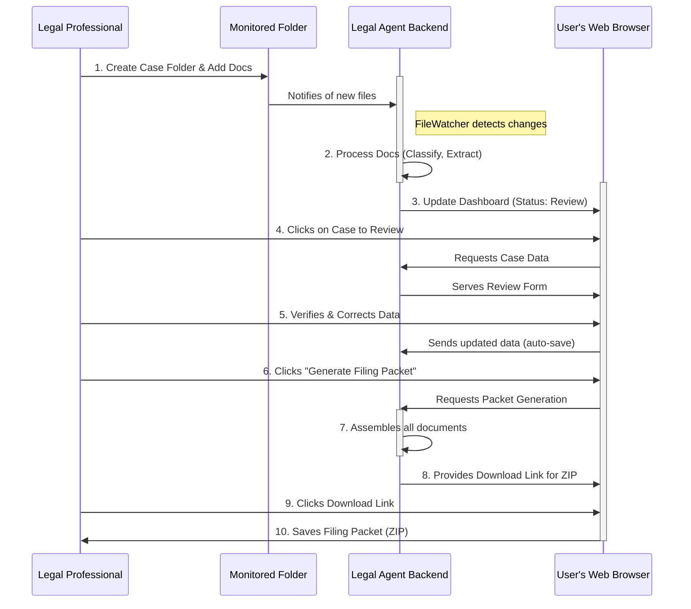

```mermaid
sequenceDiagram
    participant User as Legal Professional
    participant FileSystem as Monitored Folder
    participant Backend as Legal Agent Backend
    participant Browser as User's Web Browser

    User->>FileSystem: 1. Create Case Folder & Add Docs
    activate Backend
    FileSystem->>Backend: Notifies of new files
    Note right of Backend: FileWatcher detects changes
    Backend->>Backend: 2. Process Docs (Classify, Extract)
    deactivate Backend

    activate Browser
    Backend->>Browser: 3. Update Dashboard (Status: Review)
    User->>Browser: 4. Clicks on Case to Review
    Browser->>Backend: Requests Case Data
    Backend->>Browser: Serves Review Form
    User->>Browser: 5. Verifies & Corrects Data
    Browser->>Backend: Sends updated data (auto-save)

    User->>Browser: 6. Clicks "Generate Filing Packet"
    Browser->>Backend: Requests Packet Generation
    activate Backend
    Backend->>Backend: 7. Assembles all documents
    deactivate Backend
    Backend->>Browser: 8. Provides Download Link for ZIP
    User->>Browser: 9. Clicks Download Link
    Browser->>User: 10. Saves Filing Packet (ZIP)
    deactivate Browser
```
